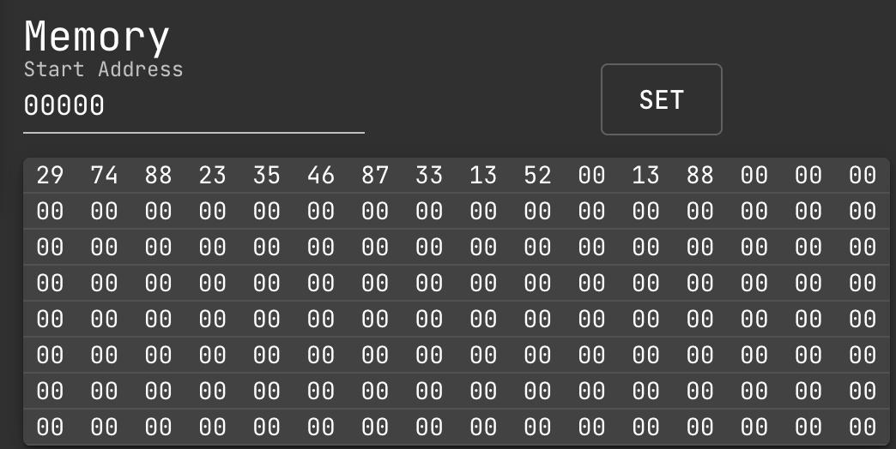

# Practical Assignment: Programming Tasks

**KAPLAN INTERNATIONAL COLLEGE LONDON – IYO COMPUTER SCIENCE PROGRAMME**  
**Module Title:** Computer Architecture  
**Module Code:** IY497  
**Pnumber:** P428742  
**Name:** Yurii Sytnichenko  

---

## My Online Compiler
For this assignment, I used an online compiler available at the following link:  
[8086 Emulator Web Compiler](https://yjdoc2.github.io/8086-emulator-web/compile)  
This allowed me to write and test my 8086 assembly code efficiently.

## Table of Contents
1. [Part 1 - Question 1](#part-1---question-1)
2. [Part 2 - Question 1](#part-2---question-1)
3. [Part 2 - Question 3](#part-2---question-3)

---

## Part 1 - Question 1


### Problem
Implement an assembly fragment, given the values of `R` and `b` in `$s0` and `$s1`, to compute a specific function and save the result in a new location.

### Code
```asm
R: DW 0x3          ; Define a variable R with a value of 3
b: DW 0x2          ; Define a variable b with a value of 2
pi: DW 0x3         ; Define a variable pi with a value of 3
RESULT: DW 0       ; Define a variable RESULT initialized to 0

start:
    MOV AX, word R     ; Move the value of R into the AX register
    MOV BX, word b     ; Move the value of b into the BX register
    MOV CX, AX         ; Copy the value of R from AX to CX
    MUL CX             ; R * R, result in AX
    MOV DX, word pi    ; Move the value of pi into DX
    SHL DX, 1          ; Multiply DX by 2 (shift left by 1 bit)
    MUL DX             ; R^2 * 2 * pi, result in AX
    DIV BX             ; Divide AX by b
    MOV word RESULT, AX ; Store result in RESULT
```

### Explanation
The code defines variables `R`, `b`, `pi`, and `RESULT`, and performs a sequence of arithmetic operations:
1. **Calculate \( R^2 \):** `R * R`
2. **Multiply by \( 2 \cdot \pi \):** Shift `pi` left and multiply.
3. **Divide by `b`:** Final result.

### Output
- **Result:** Value stored in register `AX` is `1b` in hexadecimal (decimal: 27).


---

## Part 2 - Question 1

### Problem
Student records for the computer architecture module are stored in memory, structured as follows:
- **Student ID:** First 10 bytes, ASCII
- **Module Mark:** 1 byte
- **Section Identifiers:** 2 nibbles
A subroutine `FindMax` is required to find the student with the highest mark and return their record's starting address.

### Code
```asm
vals:
    DB 0x29, 0x74, 0x88, 0x23, 0x35, 0x46, 0x87, 0x33, 0x13, 0x52
PREVIOUS: DB 0
MINIMUM: DB 0
MAXIMUM: DB 0

start:
    mov SI, 0
    mov CX, OFFSET PREVIOUS
    mov AL, byte [SI]
    
    minimum_back:
        cmp byte [SI], AL
        jnc minimum_skip
        mov AL, byte [SI]
    minimum_skip:
        inc SI
    loop minimum_back
    mov byte MINIMUM, AL
    
    mov SI, 0
    mov CX, OFFSET PREVIOUS
    mov AL, byte [SI]
    
    maximum_back:
        cmp AL, byte [SI]
        jnc maximum_skip
        mov AL, byte [SI]
    maximum_skip:
        inc SI
    loop maximum_back
    mov byte MAXIMUM, AL
```

### Explanation
This program finds the minimum and maximum values among student marks:
- **First Loop:** Finds and stores the minimum in `MINIMUM`.
- **Second Loop:** Finds and stores the maximum in `MAXIMUM`.

### Output

- **Minimum Value:** 13
- **Maximum Value:** 88

---

## Part 2 - Question 3

### Problem
Write an assembly program to solve a 4-term polynomial with the following requirements:
1. At least one exponentiated term.
2. At least three different variables.
3. One term as a multiplication of two variables.

### Code
```asm
a: DW 0x2       ; Define variable 'a' with value 2
b: DW 0x3       ; Define variable 'b' with value 3
c: DW 0x4       ; Define variable 'c' with value 4
x: DW 0x8       ; Define variable 'x' with value 8
RESULT: DW 0    ; Define RESULT initialized to 0

start:
    MOV AX, word a
    MOV BX, word b
    MOV CX, AX
    MUL CX            ; a^2
    MOV DX, word c
    MUL DX            ; a^2 * c
    MOV CX, word x
    MUL CX            ; a^2 * c * x
    DIV BX            ; Final result (a^2 * c * x) / b
    MOV word RESULT, AX
```

### Explanation
The code computes the expression \( (a^2 \cdot c \cdot x) / b \):
1. **Exponentiation (a^2):** Multiplies `a` by itself.
2. **Multiplication:** Multiplies `a^2` by `c` and then by `x`.
3. **Division:** Divides the result by `b`.

### Output


- **Result:** Value in `AX` is `2a` in hexadecimal (decimal: 42).